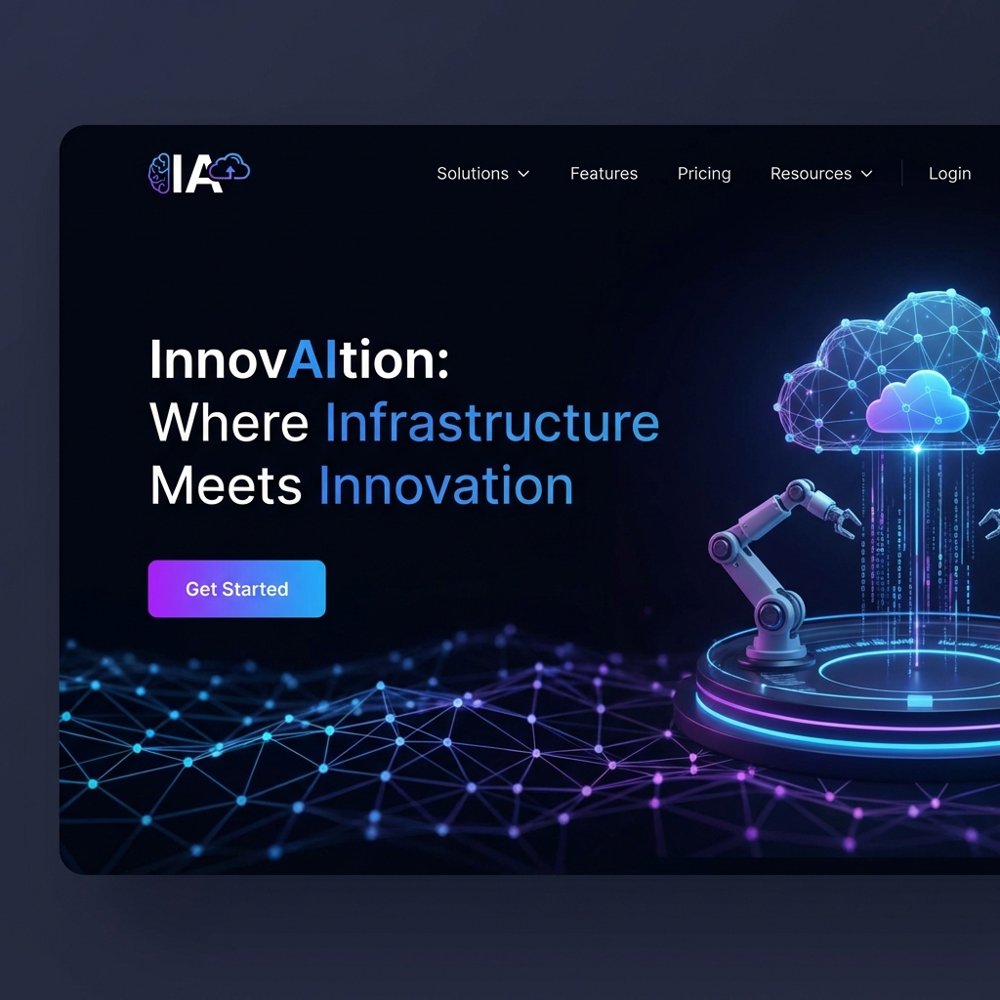
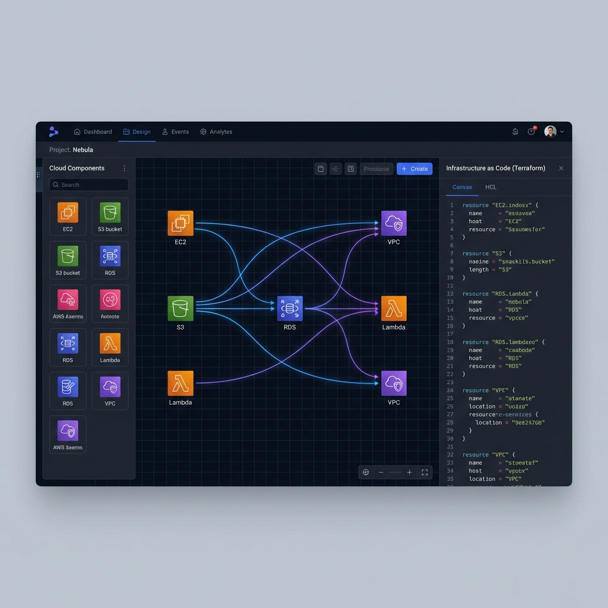
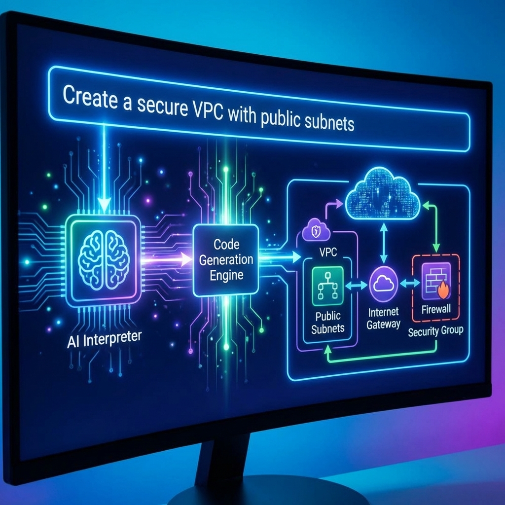

# InnovAItion 🚀
### *Where Infrastructure Meets Innovation*

[](https://react.dev/)
[](https://nodejs.org/)
[](https://www.mongodb.com/)
[](https://aws.amazon.com/)
[](https://www.typescriptlang.org/)

InnovAItion is a state-of-the-art cloud infrastructure automation platform. Build, visualize, and deploy production-ready AWS environments using a powerful drag-and-drop canvas and AI-driven code generation.

---

## 🔗 Quick Links

| Resource | Link |
| :--- | :--- |
| **🚀 Web Application** | [Launch App](https://innovaition-x-daiict-hackaton.netlify.app/) *(Confirming URL...)* |
| **📺 Demo Video** | [Watch on YouTube](https://www.youtube.com/watch?v=INSERT_ID_HERE) |
| **📄 API Documentation** | [Postman Collection](https://documenter.getpostman.com/view/INSERT_ID_HERE) |

---

## 🎨 Visual Tour (Wireframes)

### 1. The Welcome Experience
A minimalist, high-tech landing page designed to guide users into the world of automated infrastructure.


---

### 2. Intelligent Canvas Editor
The heart of InnovAItion. Drag AWS components, connect them visually, and watch the Terraform code build itself in real-time.


---

### 3. AI-Powered Workflow
Leverage Natural Language to generate complex cloud architectures instantly using our RAG-enhanced AI engine.


---

## ✨ Core Features

### 🛠️ Visual Infrastructure Design
- **Drag-and-Drop Canvas**: Intuitive placement with ReactFlow engine.
- **Auto-Networking**: Smart connection logic that handles VPCs and Security Groups automatically.

### 🤖 AI Code Generation
- **Text-to-Cloud**: Describe your stack in plain English and let the AI do the heavy lifting.
- **RAG-based Accuracy**: Precise Terraform output based on production best practices.

### 💰 Cost & Security
- **Real-time Cost Estimation**: Know your AWS bill before you deploy.
- **Compliance Checks**: Built-in security auditing for every resource.

---

## 🚀 Getting Started

### Prerequisites
- Node.js (v18+)
- MongoDB Instance
- AWS Credentials (for deployment)

### 1. Frontend Setup
```bash
cd Frontend
npm install
npm run dev
```

### 2. Backend Setup
```bash
cd Backend
npm install
npm start
```

---

## 🛠️ Technology Stack

- **Frontend**: React 18, TypeScript, Tailwind CSS, Zustand, ReactFlow.
- **Backend**: Node.js, Express, MongoDB.
- **IaC**: Terraform (HCL) generation.
- **AI**: Retrieval Augmented Generation (RAG) for infrastructure patterns.

---

## 📞 Support & Community

*Developed for the InnovAItion-X DAIICT Hackathon.*

- **Support**: Reach out via GitHub Issues.
- **Contributions**: Pull requests are welcome!

---
© 2026 InnovAItion Team. All Rights Reserved.